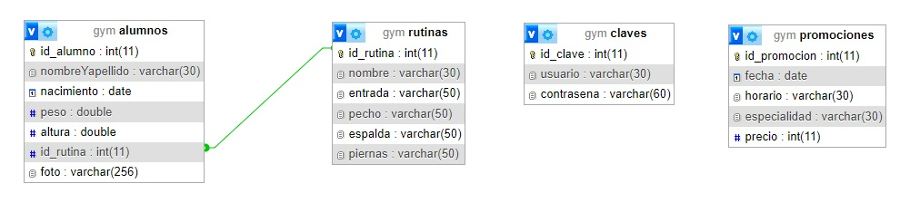

# WEB II  

Trabajo Práctico Especial

## Integrantes  

|DNI           |Apellido       |Nombre       |
|:-------------|:-------------|:-------------|
|18.038.228    |Garay         |Alejandro     |

## Tema  

*GYM*  

- El Profesor (**Administrador**) será quien diseñe las **Rutinas**, y se las asignará a cada Alumno.
- Una misma Rutina puede ser asignada a varios **Alumnos**. Pero un Alumno solo puede ejercitar una Rutina.

## Relación 1 a N  

## API REST

Se agregó al proyecto una API REST, que permite la consulta, modificación, eliminación e inserción de **promociones**, las cuales son guardadas en la nueva tabla que se agregó a la Base de Datos GYM. Las mismas también serán diseñadas por el Profesor (**Administrador**).

## Endpoints

- **GET** `/api/promos`  
  Ver todas las promociones disponibles en la tabla, permitiendo opcionalmente aplicar filtros, orden y paginación a los resultados.

---

- **GET** `/api/promos/:ID`  
  Ver la promoción correspondiente al `ID` especificado.

---

- **POST** `/api/promos`  
  Agrega una nueva promoción con los datos proporcionados en el cuerpo de la solicitud (en formato JSON).

  - **Datos requeridos**:  
    - `fecha`: Fecha de realización.  
    - `horario`: Hora en que se va a dictar la clase.  
    - `especialidad`: Disciplina a desarrollar.  
    - `precio`: Precio de la clase.

  > **Nota**: El campo `id` se genera automáticamente y no es necesario incluirlo en el JSON.

---

- **DELETE** `/api/promos/:ID`  
  Borra la promoción correspondiente al `ID` especificado.

---

- **PUT** `/api/promos/:ID`  
  Modifica la promoción correspondiente al `ID` especificado. Los datos a modificar se envían en el cuerpo de la solicitud (en formato JSON).

  - **Datos que se pueden modificar**:  
    - `fecha`: Fecha de realización.  
    - `horario`: Hora en que se va a dictar la clase.  
    - `especialidad`: Disciplina a desarrollar.  
    - `precio`: Precio de la clase.

---

- **GET** `/api/promos` + orden  

  - **Orden**:  
    - `orderBy`: Dato por el que se desea ordenar los resultados. Los datos válidos pueden ser:
      - `fecha`: Ordena por la fecha de realización.  
      - `horario`: Ordena por la hora en que se va a dictar la clase.  
      - `especialidad`: Ordena por la disciplina a desarrollar.  
      - `precio`: Ordena por el precio de la clase.

    - `orderDirection`: Dirección de orden para el dato especificado en `orderBy`. Puede ser:
      - `ASC`: Orden ascendente.
      - `DESC`: Orden descendente.
  
  - **Ejemplo de Orden**:  
  > GET /api/promos?ordenado=precio&manera=DESC  

---

- **GET** `/api/promos` + filtro  

  - **Filtro**:  
    - `filtro`: Dato por el que se desea buscar los resultados. Los datos a buscar pueder ser:
      - `fecha`: Busca por la fecha de realización.  
      - `horario`: Busca por la hora en que se va a dictar la clase.  
      - `especialidad`: Busca por la disciplina a desarrollar.  
      - `precio`: Busca por el precio de la clase.

    - `valor`: Valor que se utilizará para la busqueda. Debe ser el valor específico que se comparará con el dato filtro.

  - **Ejemplo de Filtro**:  
  > GET /api/promos?filtrado=precio&valor=1750  

---

- **GET** `/api/promos` + paginación  

  - **Paginación**:  
    Permite ver los resultados divididos en páginas, cada página tendrá un número de hoja, y cada hoja tendrá un número de renglones.

    - `pagina`: Número de hoja solicitada.
    - `cantidad`: Cantidad de renglones por hoja.

  - **Ejemplo de Paginación**:  
  > GET /api/promos?pagina=3&cantidad=5  
  
---

### Autenticación

Para poder hacer el ABM de las PROMOCIONES, el ADMINISTRADOR debe autenticarse utilizando un **token**.  

- **POST** `/usuarios/token`  
  Este endpoint permite al Administrador obtener un token JWT. Se deben enviar las credenciales en el encabezado de la solicitud en formato Base64 (usuario:contraseña).

  - **iniciar sesión**:  
    - **Nombre de usuario**: `webadmin`  
    - **Contraseña**: `admin`

  - **Respuesta**:  
    Si las credenciales son válidas, se devuelve un token JWT que puede ser utilizado para autenticar futuras solicitudes a la API.

---

<!-- Fecha de entrega tercera parte: 17/11/24 -->  
